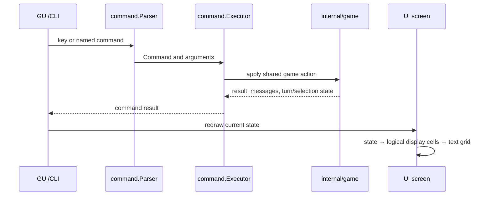
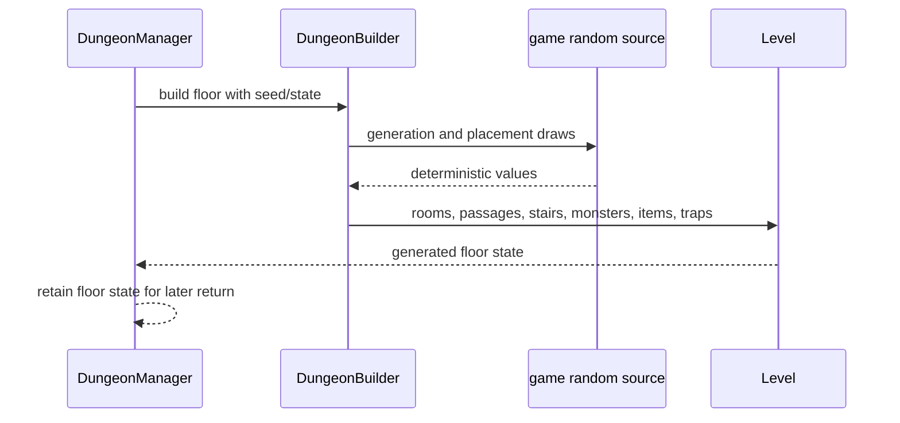
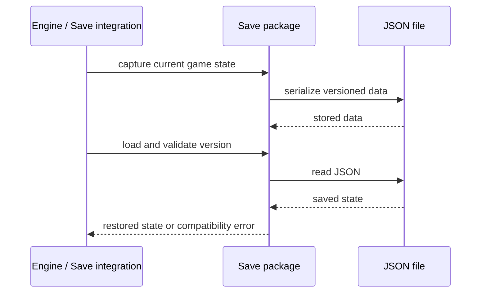

# 現行シーケンス図

要件の正は [`../SPEC.md`](../SPEC.md)、図の詳細は現行 Go コードとテストです。過去の Python クラスや未実装コンポーネントを図示しません。

## コマンド実行

```mermaid
sequenceDiagram
    participant Input as GUI/CLI
    participant Parser as command.Parser
    participant Executor as command.Executor
    participant Rules as internal/game
    participant Screen as UI screen

    Input->>Parser: key or named command
    Parser->>Executor: Command and arguments
    Executor->>Rules: apply shared game action
    Rules-->>Executor: result, messages, turn/selection state
    Executor-->>Input: command result
    Input->>Screen: redraw current state
    Screen->>Screen: state → logical display cells → text grid
```

## 階層生成と移動

```mermaid
sequenceDiagram
    participant Manager as DungeonManager
    participant Builder as DungeonBuilder
    participant RNG as game random source
    participant Level as Level

    Manager->>Builder: build floor with seed/state
    Builder->>RNG: generation and placement draws
    RNG-->>Builder: deterministic values
    Builder->>Level: rooms, passages, stairs, monsters, items, traps
    Level-->>Manager: generated floor state
    Manager-->>Manager: retain floor state for later return
```

## 保存・復元

```mermaid
sequenceDiagram
    participant Game as Engine / Save integration
    participant Save as Save package
    participant File as JSON file

    Game->>Save: capture current game state
    Save->>File: serialize versioned data
    File-->>Save: stored data
    Game->>Save: load and validate version
    Save->>File: read JSON
    File-->>Save: saved state
    Save-->>Game: restored state or compatibility error
```
