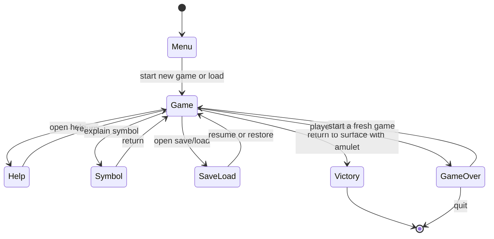

# 現行状態遷移

状態名は `internal/core/state/state.go` の `GameState`、実際の遷移は各画面の `HandleInput` と `internal/core/engine.go` にあります。以下は現在の画面状態とゲーム終了境界のみを示します。

## 行動のターン順

GUI と CLI の双方は同じ `internal/core/command.Executor` を呼びます。選択入力などでターンを消費しない場合はモンスター更新を実行しません。ターンを消費する行動ではプレイヤー行動の適用後にモンスター側の更新を行います。細部は executor とパッケージテストが根拠です。
